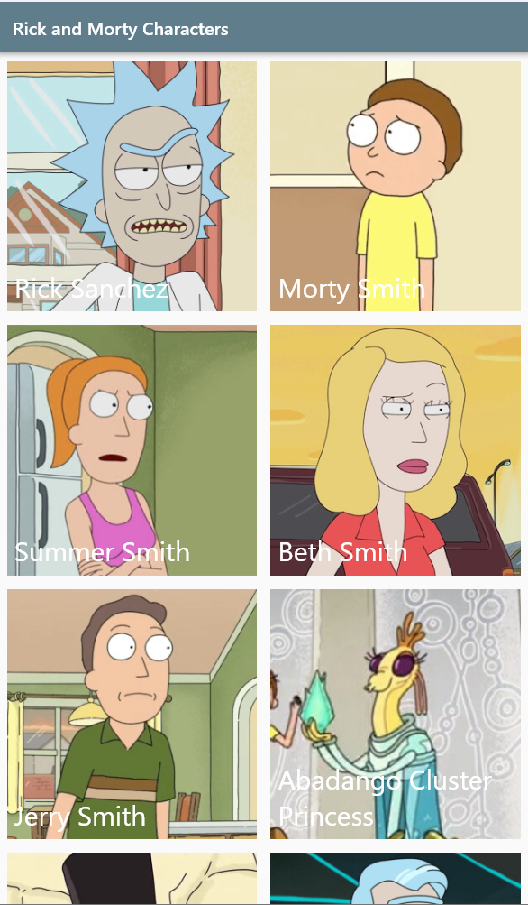
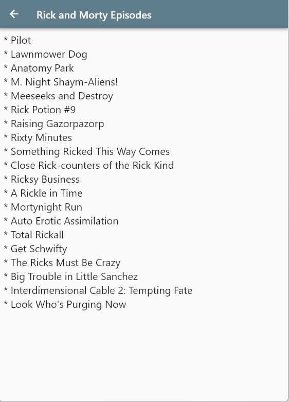

# 0x01. Flutter - Flutter Intro

Hello everyone ! In this projet, I will create my first Rick and Morty themed Flutter project using the [Rick and Morty API](https://intranet.hbtn.io/rltoken/3JC-FnRel9hFVzEFHiNAuQ).

## Setup Flutter

- [Install Flutter](https://intranet.hbtn.io/rltoken/fRg3_57nW2Q4bthqxJVmnQ)
- [How to Install Flutter on Windows](https://intranet.hbtn.io/rltoken/338lXGJdtmI4xAidmkoByA)
- [How to Install Flutter on macOS](https://intranet.hbtn.io/rltoken/nyy_5fw3FYHkfavvuiTv1A)
- [Setup Flutter in Visual Studio Code](https://intranet.hbtn.io/rltoken/_tDILBGQmsOK4VSpG_Sxlg)

## Steps

### 1- Create the characters page

### 2- Create the episodes page

